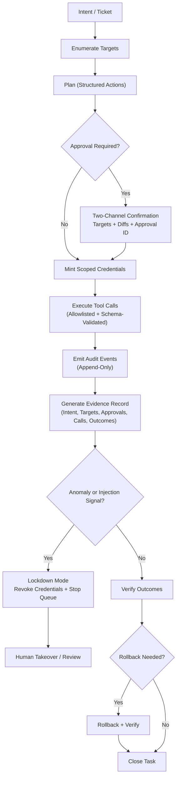

# Operational Readiness Criteria for Tool-Using LLM Agents

Operational readiness criteria for tool-using LLM agents: autonomy budgets, controls, metrics, and rollout gates for delegated autonomy.

## What this is
This repository contains a draft technical paper that proposes a practical readiness model for deploying tool-using LLM agents in real systems. It treats agentic AI as a deployment shift where model outputs can become state-changing actions through tools, credentials, and multi-step execution.

## What this is not
This is not a vendor comparison, not a policy manifesto, and not a claim that agentic AI is inherently unsafe. It is written as an operational field manual intended to be applied in production environments.

## Document status
Draft for community review. Feedback is welcomed, especially on:
- Missing failure modes or edge cases
- Readiness gates that are unrealistic in practice
- Metric definitions and better formulas
- Tier 4 (multi-agent) operational controls

## Why This Is On GitHub
This repository maintains an auditable, version-controlled history of the paper's evolution. All changes are tracked with commit history, enabling transparent development and community contribution.

## Paper
The paper is maintained under `paper/`.

- Latest draft (PDF): `paper/agentic-ai-readiness-v0.3.pdf`
- Latest draft (source): `paper/agentic-ai-readiness-v0.3.md`
- Latest draft (tex): `paper/main.tex`

## Repository structure
- `paper/`  
  Current paper drafts, appendices, figures, and reference notes
- `paper/appendices/`  
  Reusable templates and checklists (autonomy budget, scorecard, audit schema, scenarios, rollout checklist)
- `examples/`  
  Worked examples for budgets, audit events, and harness scaffolding
- `.github/`  
  Issue and PR templates for community feedback

## How to use the paper
Use the document as an implementation sequence:
1. Identify relevant failure modes
2. Apply readiness gates by capability tier
3. Implement enforceable control patterns
4. Add audit events and anomaly signals
5. Validate using the evaluation harness and metrics
6. Roll out by phase using the rollout ladder

Tier 2 and above is not eligible without rollback readiness and evidence capture for every permitted write action.

## License
See `LICENSE`.

## Citation

Version DOI (v1.0): <https://doi.org/10.5281/zenodo.19211676>
Concept DOI (all versions): <https://doi.org/10.5281/zenodo.19211667>
Zenodo record: <https://zenodo.org/records/19211667>

## Contributing
Suggestions and corrections are welcome.
- Use Issues for problems, missing coverage, or proposed changes
- Use Pull Requests for concrete edits

Please keep contributions focused on operational deployability: controls, metrics, auditability, and recovery.

## Contact
Rogel S.J. Corral (Independent Researcher)
